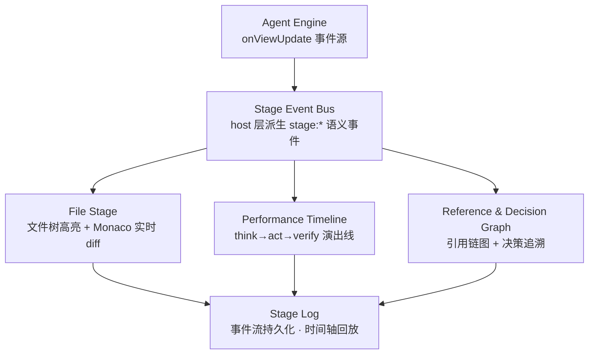

# VTE Stage — 可视化舞台实现计划

> 把黑盒的 Agent 推理 / 决策 / 修改 / 校验全流程，变成可观测、可交互、可回溯的「演出」。
> 本计划只动 **web-ide 宿主层**（server 派生事件 + client 可视化），核心层 `src/agent/*` 保持框架无关、零 `vscode` import。

---

## 1. 目标与定位

Web IDE 不做传统 IDE，做成 **LLM 操作可视化舞台（VTE Stage）**：

- LLM 说「修改了 `foo.ts`」→ 左栏文件树该文件名**脉动高亮**，旁边 **Monaco** 实时显示 before→after 改动。
- 右栏引入 **LLM 引用链可视化**，随 agent 读/改文件动态生长。
- 中栏叠加 **演出时间轴**，把 think→act→verify 串成可见的步骤流。
- 底层 **Stage Log** 落盘事件流，支持时间轴回放（可回溯任意时刻的舞台状态）。

---

## 2. 现状基础（已具备，无需重造）

| 能力 | 现状 | 来源 |
|------|------|------|
| 事件源 | `engine.onViewUpdate` 实时吐 `tool_call` / `tool_result`（写文件时参数含 `path`+`content`）/ `thinking_*` / `stream_chunk` / `permission_request` / `question_request` | `src/agent/engine.ts` |
| WS 转发 | web-ide server 已把 onViewUpdate 裸发 + 映射（`thinking_start`→`thinking` 等）经 WS 给前端 | `web-ide/server/index.ts` |
| 三栏 UI | 左（文件树/Git）、中（对话/Input）、右（Agent/工单/Token）齐活 | `web-ide/client/src/App.vue` |
| 文件树 | `ProjectTree.vue` 已能渲染递归树（TreeNode），但**无「被 LLM 改了就高亮」能力** | `web-ide/client/src/components/ProjectTree.vue` |
| 文件预览 | 现是 `highlight.js` + `<pre>` + 只读 `<textarea>` 的 **modal**，**未引入 Monaco** | `App.vue` file-preview-modal |

**缺口（本计划要补）**：
1. 缺少**语义化舞台事件**——前端现在得自己解析 `tool_call.arguments` 才知道改了哪个文件，脆弱。
2. 没有 **Monaco**、没有**引用图**、没有**时间轴 / 回放**。

---

## 3. 总体架构（四层）



- **Stage Event Bus**：在 web-ide server（host 层）把通用 `tool_call` / `tool_result` 派生成语义化 `stage:*` 事件。前端只订阅 `stage:*`，**不再解析工具参数**。
- 三块舞台面板各自消费关注的 `stage:*` 事件。
- 所有 `stage:*` 事件汇入 Stage Log，支持回放。

---

## 4. 事件 Schema 设计（核心契约）

在 `web-ide/server/index.ts` 的 onViewUpdate 映射逻辑里，解析 `tool_call` + `tool_result` 派生以下事件，经 WS 下发：

```ts
// 文件被触碰（读/写/改/删）
type StageFileTouch = {
  type: 'stage:file_touch'
  ts: number
  agentId: string
  path: string
  op: 'read' | 'write' | 'edit' | 'delete'
}

// 写文件完成（带改动前后内容，供 Monaco diff）
type StageFileWriteDone = {
  type: 'stage:file_write_done'
  ts: number
  agentId: string
  path: string
  before: string   // 写前内容；新文件为空串
  after: string    // 写后内容
}

// 引用关系（文件/符号 → 文件/符号）
type StageReference = {
  type: 'stage:reference'
  ts: number
  agentId: string
  from: string
  to: string
  kind: 'imports' | 'calls' | 'tests' | 'type'
}

// 关键决策点
type StageDecision = {
  type: 'stage:decision'
  ts: number
  agentId: string
  summary: string
  considered?: string[]   // 考虑过的备选方案
}

// 校验环节
type StageVerify = {
  type: 'stage:verify'
  ts: number
  agentId: string
  command: string
  passed: boolean
}

// agent 阶段机（驱动时间轴节点态）
type StageAgentStep = {
  type: 'stage:agent_step'
  ts: number
  agentId: string
  phase: 'think' | 'act' | 'verify' | 'idle'
}
```

### 派生逻辑（放在 server，不污染核心）
- `tool_call.name === 'write_file'` → 解析 `arguments.path` / `arguments.content` → 发 `stage:file_touch{op:'write'}`，暂存 `content` 作 `after`；待对应 `tool_result` 到达后，用写前内容（`fs` 读 `before`）+ `after` 组装 `stage:file_write_done`。
- `tool_call.name === 'read_file'` → `stage:file_touch{op:'read'}`。
- `tool_call.name === 'delete_file'` / 重命名 → `stage:file_touch{op:'delete'}`。
- 引用（MVP 粗粒度）：从 `read_file` 目标 + 其 `import` 语句抽 `stage:reference{from:target, to:imported, kind:'imports'}`；后续阶段接 LSP/tsc 提精度。
- `thinking_start` → `stage:agent_step{phase:'think'}`；`tool_call` → `stage:agent_step{phase:'act'}`；`stage:verify` 由校验工具结果派生。

### 协议改动
- 前端 `web-ide/client/src/protocol.ts`：扩展 `ViewUpdate` union，加入上述 6 个 `stage:*` 类型。
- `web-ide/client/src/ws.ts`：透传（已透传 `update` 包，无需改）。
- server 映射处（`index.ts` handleViewUpdate）：新增 `stage:*` 分支经 `ws.send`。

---

## 5. 分阶段实现计划

### M1 / MVP：File Stage（最核心体感）✅ 已落地
**目标**：LLM 说改 `X` → 文件树 `X` 高亮 + 旁边 Monaco 显示 before→after。

1. **后端派生**：`web-ide/server/index.ts` 在 onViewUpdate 映射里解析 `tool_call`/`tool_result`，发 `stage:file_touch` + `stage:file_write_done`。
2. **协议扩展**：`protocol.ts` 的 `ViewUpdate` union 加入这 2 个事件；`ws.ts` 透传。
3. **前端 — 文件树高亮**：
   - `ProjectTree.vue` 增加 `touched: Map<string, 'read'|'write'|'delete'>` 状态；接 `stage:file_touch`。
   - `TreeNode.vue` 按 `op` 上色：写=紫脉动、读=蓝、删=红（用 `--vte-*` CSS 变量；脉动用 `@keyframes` 限 `transform`/`opacity`）。
4. **前端 — Monaco Diff Dock（替换现 modal 预览）**：
   - 新增 `web-ide/client/src/components/MonacoDiffDock.vue`（常驻 dock，非 modal）。
   - 用 `@monaco-editor/loader` + `monaco-editor` 的 `editor.createDiffEditor`，收到 `stage:file_write_done` 自动打开该文件 `before`→`after`。
5. **Monaco 集成踩坑**：
   - 依赖装到 `web-ide/node_modules`（`cd web-ide && npm i monaco-editor @monaco-editor/loader`）。
   - Vite worker 配置：用 `?worker` 导入或 `vite-plugin-monaco-editor`；否则浏览器报 `Could not create web worker`。
   - 主题：用 `monaco.editor.defineTheme` 基于 `--vte-*` 变量（或 vs-dark 后用 CSS 变量覆盖容器），不要硬编码颜色。
6. **验证**：MOCK 模式（`VTE_MOCK=1`）**无法触发真实 tool_call**（mock 是回显），需用真实 responses 模型（o-series/gpt-5）跑几轮「读取/修改文件」话术，观察文件树高亮 + Monaco diff。

**✅ 已落地（2026-07-20）**
- 后端派生：`web-ide/server/index.ts` 的 `emitUpdate` 新增 `deriveStageFileTouch` / `flushStageFileWrite`，在 `tool_call` 时读磁盘拿 `before` 入 `pendingWrites`，`tool_result` 时读 `after` 发 `stage:file_write_done`（工具名 `read`/`edit`/`write`，参数 `path`/`content`；`agentId` 默认 `main`）。
- 协议：`client/src/protocol.ts` 的 `ServerMessage` 新增 `StageFileTouch` / `StageFileWriteDone`。
- 文件树高亮：`webview/src/components/TreeNode.vue` 加可选 `touched` prop（按 path 命中 op，目录/文件双向标）；`web-ide/client/src/components/ProjectTree.vue` 接 `touched`、watch 变化时自动展开并加载祖先目录使改动文件可见。配色 token 加到 `webview/src/theme.css`（`--vte-stage-*`）：写=紫脉动 / 改=橙 / 读=蓝 / 删=红。
- Monaco Diff Dock：`web-ide/client/src/components/MonacoDiffDock.vue`（常驻 dock，非 modal），`App.vue` 用 `defineAsyncComponent` 懒加载，收到 `stage:file_write_done` 即开该文件 before→after。
- **Web 性能设计（按你的强调）**：
  - 仅 `import 'monaco-editor/esm/vs/editor/editor.api'`（不含全量语言包）；`MonacoEnvironment.getWorker` 只返回**基础 editor worker**——不加载 TS/JSON/CSS 语言 worker，diff 计算在 worker 线程、主线程不被语法服务拖慢；diff 内容用 `plaintext` 无语言高亮（绿色增/红色删的 diff 着色才是要的信号）。
  - 单例复用一个 DiffEditor（`setModel` 切换文件），不在每次写入 create/dispose。
  - `requestAnimationFrame` 合并一帧内的突发写入。
  - `automaticLayout` 免去手动 resize 监听。
  - 懒加载：monaco chunk（`MonacoDiffDock-*.js` ≈2.5MB）与 `editor.worker`（≈252KB）从主包剥离，构建产物主包仅 ≈385KB，首次写入才下载。
- **验证**：① node 脚本（`scripts/stage-derive.test.mjs`，mock fs）覆盖 编辑现有文件 / 读 / 写新文件 / 孤儿 tool_result 四场景，before/after、不误发 diff、pending 清空、agentId 全 PASS；② `vite build` 成功且确认 monaco 已代码分割成独立 chunk；③ mock 模式 server 启动正常（stage 派生逻辑不报错）。真实 E2E（文件树脉动高亮 + Monaco diff）需接 responses 模型（o-series/gpt-5）跑「读/改文件」话术观察。

### M2：Performance Timeline（中栏演出线）
- 新增 `web-ide/client/src/components/StageTimeline.vue`：把 `thinking_*` / `tool_call` / `tool_result` / `stage:verify` 串成横向步骤条；节点状态（脉动=think / 转圈=act / 打勾=done）。
- 接 `stage:agent_step` 驱动阶段切换。
- 可点开节点看细节（复用现有 `StatusLog` 或独立详情浮层）。

### M3：Reference & Decision Graph（右栏）
- 新增 `web-ide/client/src/components/ReferenceGraph.vue`（用 **vue-flow**，Vue3 原生）：节点=文件/符号，边=引用；随 `stage:reference` 动态生长，焦点文件高亮。
- 引用抽取增强：后端用轻量正则 / TS 编译器 API 抽 import / 调用关系（或让 LLM 在 `stage:decision` 里附带引用）。

### M4：Decision Trail + Stage Log 回放
- `web-ide/client/src/components/DecisionTrail.vue`：列 `stage:decision` 关键决策点，可点开看 `considered` 备选。
- **Stage Log**：把 `stage:*` 事件流 append-only 落 `<root>/.vte/stage-log.jsonl`（复用核心 `FsHistoryStore` 持久化原语，或新加 `StageLogStore`）。
- 新增时间轴 **scrubber** 组件，拖动回放任意时刻的舞台状态（哪些文件被改、引用图长什么样）。

---

## 6. 约束与验收

- **核心层零 `vscode` import、框架无关**：所有 `stage:*` 事件派生放在 web-ide server（host 层）；核心 `src/agent/*` 只负责把更丰富的事件吐出（或在 host 派生），**不引入任何前端依赖**。验收硬指标：`grep vscode src/agent` 干净。
- **主题一律 `--vte-*`**：新增组件样式走 `webview/src/theme.css` 的 `c-` 命名空间，禁止硬编码颜色。
- **组件化**：新控件抽成可复用组件（遵循 `SliderControl.vue` 范式：逻辑在 `components/Xxx.vue`，样式在 `theme.css`）。
- 每阶段**独立可验证、可回退**（不依赖后续阶段）。

---

## 7. 风险 / 待定

| 项 | 说明 | 对策 |
|----|------|------|
| Monaco worker | Vite 子工程 worker 配置细节需实测 | M1 第一步先验证 loader + worker 能起 |
| 引用图精度 | MVP 粗粒度（read→import） | 后续接 LSP / tsc 提精度，不阻塞 MVP |
| 回放状态重建 | M4 复杂度高 | 后置；先落日志，回放 UI 可简化 |
| 多 agent 并发 | PM 拆单后多 agent 同时改文件 | `stage:*` 带 `agentId`，前端按 agent 分色/分轨 |

---

## 8. 执行顺序建议

```
M1 File Stage  ──►  M2 Timeline  ──►  M3 Reference Graph  ──►  M4 Decision + Replay
   （最快出体感）   （演出线）        （引用可视化）        （可追溯闭环）
```

每完成一阶段：提交到 `web-ide` 子工程独立 commit，推送前跑 `node scripts/smoke.mjs` 确认 WS 冒烟仍 PASS。
